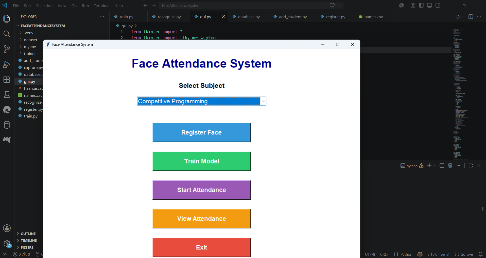
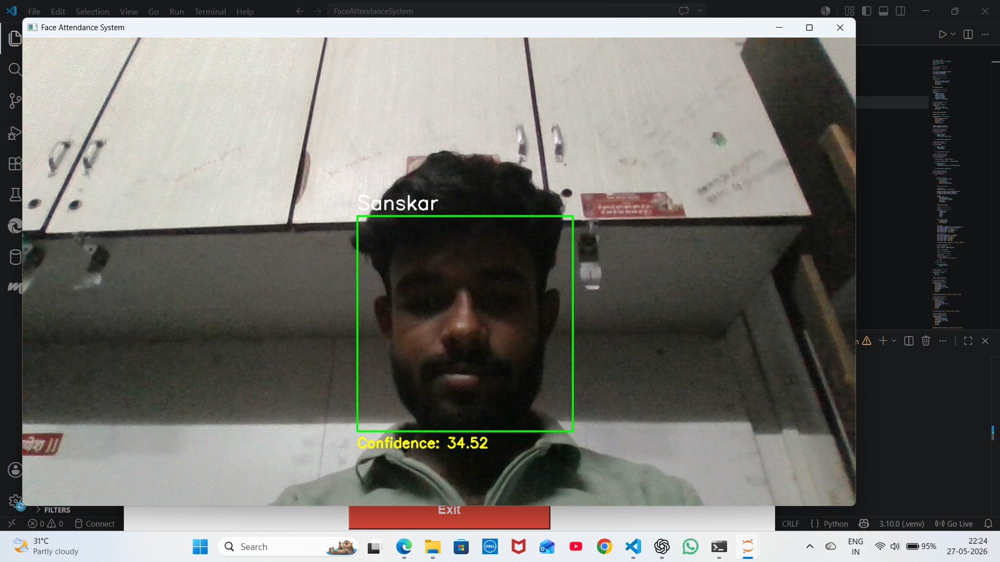
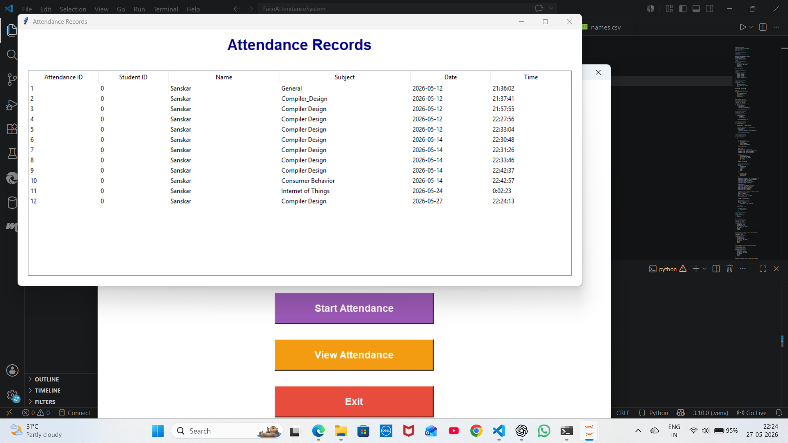

# Face Recognition Attendance System

## Overview
This project is an AI-based Face Recognition Attendance System developed using Python, OpenCV, and Tkinter. The system automatically detects and recognizes faces and marks attendance in CSV/Excel format.

## Features
- Face Detection using OpenCV
- Real-time Face Recognition
- Attendance Marking System
- CSV and Excel Export
- User-friendly GUI using Tkinter

## Technologies Used
- Python
- OpenCV
- NumPy
- Pandas
- Tkinter

## Project Structure
```bash
Face-recognition-attendance-system/
│
├── gui.py
├── recognize.py
├── register.py
├── train.py
├── names.csv
├── haarcascade_frontalface_default.xml
├── attendance/
├── trainer/
```

## Installation

### Step 1
Clone the repository

```bash
git clone https://github.com/sanskardeshmukh07-arch/Face-recognition-attendance-system.git
```

### Step 2
Install required libraries

```bash
pip install -r requirements.txt
```

### Step 3
Run GUI

```bash
python gui.py
```

## Future Enhancements
- MySQL Database Integration
- Subject-wise Attendance
- Admin Dashboard
- Cloud Storage
- Email Attendance Reports

## Team Members
- Sanskar Deshmukh
- Pradip Pawar
- Harshad Jare
- Rahul Kashid

## Screenshots

### GUI


### Face Recognition


### Attendance Output

